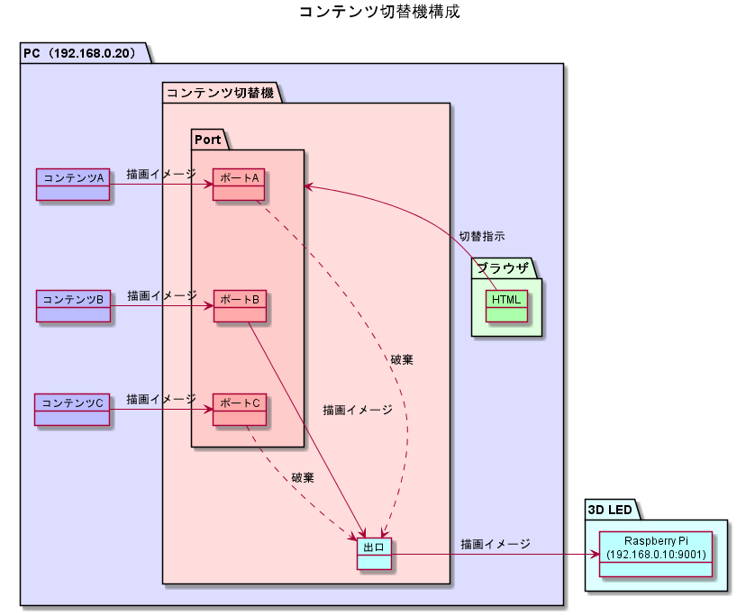

# 3D LEDコンテンツ切替アプリケーション

## 背景

3D LEDのコンテンツは複数あるが、3D LEDは１台しかないため切替作業が必要である。  
従来はエンジニアがコマンドを叩いて切り替えていたため、基本的に来場者に１つのコンテンツしか見せることができなかった。  
もっとユーザーフレンドリーな切替方法を検討し、来場者にいろんなコンテンツを楽しんでもらえるようにしたいと考えた。

## コンテンツ切替機の構成

## 環境構築

以下をインストール
* ruby 2.5.0
* bundler

bunderでまとめてgemをインストールする。

`$ bundle install`

## 実行

`bundle exec rackup`

ポート番号は4567（sinatraのデフォルト）

## コンテンツ編集

app.rbファイルを開いて、$contentsを編集してください。
